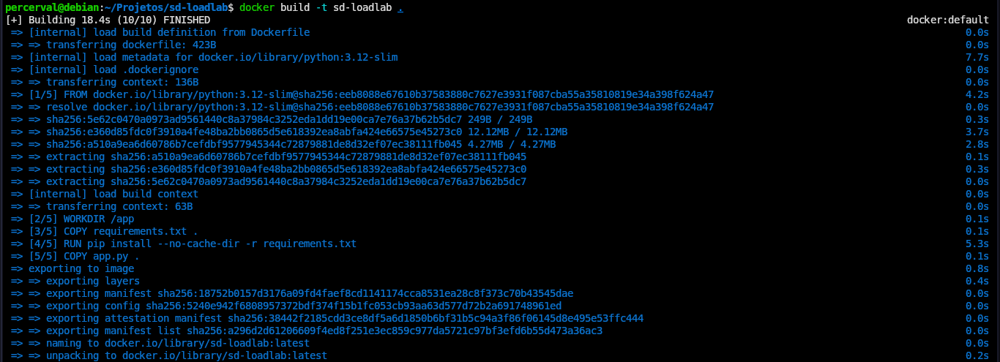
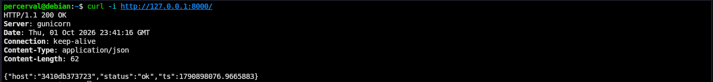
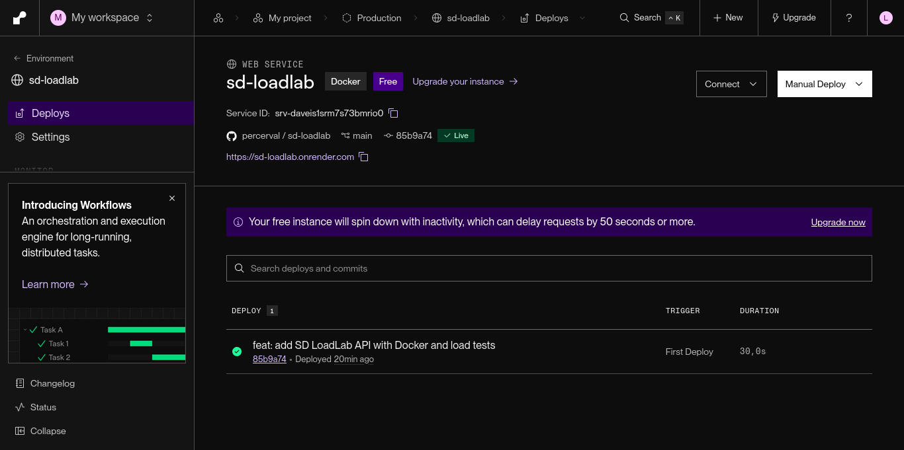

# RELATÓRIO — PRÁTICA 1: DOCKER & DEPLOY PaaS (máx. 2 páginas)

**Disciplina:** Sistemas Distribuídos — IFPA Campus Ananindeua
**Equipe:** Ian Lucas Lobato Barra da Silva e Leonardo Jacomini Barcos
**Repositório:** https://github.com/percerval/sd-loadlab
**URL pública:** https://sd-loadlab.onrender.com
**Data da execução:** 01/10/2026

## 1. Objetivo
Conteinerizar uma API REST em Python e publicá-la em uma plataforma PaaS, tornando-a acessível por uma URL pública.

## 2. Aplicação
API SD LoadLab desenvolvida em Flask com quatro endpoints: `/` (health check), `/items` (listagem com latência simulada de 20 ms), `/items/<id>` (consulta individual) e `/cpu` (processamento com hashes SHA-256). A rota de CPU aceita de 1 a 1.000.000 de iterações e rejeita entradas inválidas com HTTP 400. O Gunicorn usa 2 workers e 4 threads por worker. O servidor de desenvolvimento do Flask também suporta threads, mas não é recomendado para produção. Threads favorecem concorrência de I/O; processos permitem explorar múltiplos núcleos quando disponíveis.

## 3. Conteinerização (Dockerfile)
- **Imagem base `python:3.12-slim`:** imagem enxuta, reduz tamanho e tempo de build.
- **Cópia do `requirements.txt` antes do código:** aproveita o cache de camadas do Docker — as dependências só são reinstaladas se mudarem.
- **`--no-cache-dir`:** não guarda cache do pip, imagem menor.
- **Porta via variável `PORT`:** o PaaS define a porta em tempo de execução; o container se adapta.
- **`.dockerignore`:** evita copiar arquivos desnecessários para a imagem.

As Figuras 1 e 2 documentam o build concluído e a resposta HTTP do container local.

## 4. Deploy na plataforma PaaS (Render)
O código foi versionado e publicado no GitHub. No Render, o serviço foi construído pelo Dockerfile e disponibilizado com HTTPS. O log registrou **“Your service is live” em 01/10/2026 às 23:15:27 UTC**, com URL pública `https://sd-loadlab.onrender.com`.

O Gunicorn iniciou em `0.0.0.0:10000`, com dois workers do tipo `gthread`. Embora o Render tenha definido `WEB_CONCURRENCY=1`, a opção explícita `--workers 2` prevaleceu. O arquivo `render.yaml` especifica runtime Docker, plano Free e health check `/`.

**Validação:** o build Docker local e os nove testes automatizados passaram; `pip check` não encontrou conflitos de dependências. Na URL pública, `/`, `/items`, `/items/1` e `/cpu?n=20000` retornaram HTTP 200; `/items/51` retornou 404 e `/cpu?n=abc`, 400. A listagem retornou os 50 produtos esperados.

A Figura 3 confirma o serviço Live, o plano Free e a URL pública no painel do Render.

## 5. Dificuldades e soluções
- **Validação da carga:** o código inicial convertia `n` sem tratar entradas inválidas e não limitava o trabalho solicitado. Foram adicionados tratamento de erro e limites, com resposta JSON e HTTP 400. Isso reduz o custo por requisição, mas não substitui rate limiting.
- **Publicação inicial:** a primeira tentativa de commit não tinha arquivos preparados; foi resolvida com `git add`. O primeiro push exigiu configurar o upstream com `git push -u origin main`.
- **Operação no PaaS:** a porta é obtida de `PORT`, o Gunicorn é iniciado com `exec` e os logs vão para stdout/stderr. Essas escolhas facilitam inicialização, encerramento e diagnóstico no ambiente hospedado.

## 6. Conclusão
Foi possível construir e executar a aplicação localmente com Docker e publicá-la no Render, com as rotas verificadas por HTTP. O container padroniza runtime e dependências, mas não torna hardware ou rede idênticos entre ambientes. O PaaS simplificou a publicação com HTTPS, enquanto Gunicorn e logs de execução forneceram a base operacional. A aplicação é um laboratório stateless, sem banco de dados real, adequado aos testes de carga da Prática 2.

## Evidências de execução

*Figura 1 — Build local da imagem `sd-loadlab`, concluído com sucesso.*

*Figura 2 — Requisição a `127.0.0.1:8000`, com HTTP 200, servidor Gunicorn e status `ok`.*

*Figura 3 — Serviço `sd-loadlab` no Render: Docker, plano Free, status Live e URL pública.*
